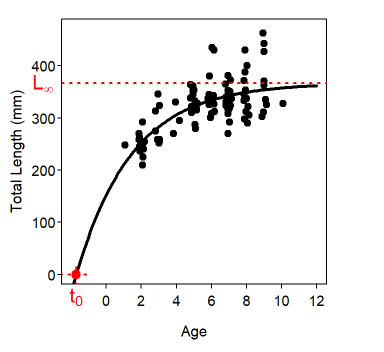
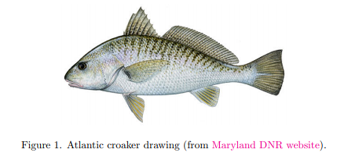

## How to estimate a Von Bertalanffy growth curve

We will estimate a Von Bertalanffy Growth Curve. You have collected age and length data. Open the `lab Von Bert` file in Excel (tab: Exercise 1)

Now, still in Excel, do a scatter-plot with the data. Make sure age is in the x axis and length is in the y axis. This plot should represent the Age-Length relationship and it is what we use to model the Von Bertallanfy growth curve.

#### Von Bertallanfy

The Von Bertalanffy curve represents the relationship between age and size, and usually looks something like this:



and the model has the following equation:

$$
L_t = L_\infty (1-e^{-K(t-t_0)})
$$

Where

$L_t$ is the expected length at time (or age) t

$L_\infty$ is the maximum length that the fish will approach, but never get to

$K$ Is the "Brody growth rate coefficient". This is pretty hard to interpret, but the higher k the faster a population reaches $L_\infty$

$t$ is time or age

$t_0$ It is a modeling artifact. It represents the time (or age) at which the expected length is zero. It is not a real biological parameter, as there are no negative ages, but this can be negative.

Look at the data you plotted in Excel. With your knowledge of the Von-Bertalanffy growth curve, let's guess a potential value for the parameters.

K can be pretty tough to guess, so I will help with this one.

**K: 0.3**

Guess a value for :

$L_\infty$

$t_0$

These should be values that **MAKE SENSE! Look at the Excel plot to come up with them**

**Put these values in cells G2, G3, and G4 in excel.**

::: callout-warning
## Question 1. 1 pt

Explain how you chose your values for $L_\infty$ and $t_0$
:::

Use the von-Bertalanffy growth function to determine expected length values. Put those expected length values in column C. Make sure to reference the cells:

::: callout-tip
## Tip \# 1

In Excel, instead of directly typing numbers into a formula, reference the cells containing those values. For example, instead of writing `=2*3+5`, use `=A1*B1+C1`, where A1, B1, and C1 hold the numbers. This makes the formula dynamic and easy to update.
:::

Now plot the expected values (ON THE SAME PLOT) but as a line.

::: callout-warning
## Question 2.1 pt

Look at your data (points) and your expected length (line). Where your initial values good?
:::

Now, try different combinations of the values, until you find a good one.

::: callout-warning
## Question 3. 1 pt

Report the best values you found
:::

Now, let's use solver to find a solution.

1.  In column D, calculate the difference between observed lengths, and expected lengths
2.  Then in column E estimate the squared differences
3.  Estimate the sum of squares (sum of the squared differences)
4.  Now, use solver to find the values of $K$, $L_\infty$ and $t_0$ that minimize the sum of squares

::: callout-warning
## Question 4. 1 pt

Report your values, and answer, where your values in Q3 close to the best values found by solver?
:::

::: callout-warning
## Question 5. 1 pt

Please upload your plot to Canvas
:::

## Von Bertalanffy curve in R

We will install two packages:

`FSAdata` is a package that have a lot of fisheries data. We will use one of the datasets in `FSAdata`

`AquaticLifeHistory` analyses Fisheries life history analysis using contemporary methods

We will look at age and length data of Atlantic Croaker:

{width="462"}

load the `FSAdata` package, and read the data:

```{r}
library(FSAdata)
data(Croaker2)
```

::: callout-warning
## Question 6. 1 pt

Please answer: what are the variables in this dataset?
:::

Now, because growth can be different between males and females, we will only look at the male fish.

The following code is incomplete, complete it in order to create a new object that contains only males:

```{r eval=FALSE}
crm<-subset(Croaker2,sex==)
```

```{r echo=FALSE}
crm<-subset(Croaker2,sex=="M")
```

Now, let's load the package

```{r}
library(AquaticLifeHistory)

```

And let's run the code to obtain the Von Bertalanffy growth curve:

```{r}
Estimate_Growth(data = crm)
```

That was easy! But it gives us 3 models! The Gompertz, Logistic, and Von Bertalanffy. The Von Bertalanffy is the only one we are interested in. Run the following code:

```{r eval=FALSE}
?Estimate_Growth
```

That should open the help file for this function. See if there is a way to specify a model, and re-run the code but only for the von Bertalanffy growth curve.

::: callout-warning
## Question 7. 1pt

Upload your plot to Canvas
:::

## Thinking exercise. 3pts.

For this final exercise there won't be many instructions, and you are tasked with solving it by yourself. There will be NO help from me or Lexie for this one!

Open the excel file and go to the Exercise 2 tab.

A field crew sampling white crappies measured the lengths of all individuals. However, they only aged a smaller subsample within each length group (aging fish is time consuming!). Your task is to estimate how many fish from the **entire sample** belong to each age group.

Using the aged subsample as a guide, determine how the total number of fish in each length group should be distributed across ages. Think about how the subsample represents the larger group and use that information to make your estimates. Make sure the total number of fish remains the same before and after allocation.

Upload the excel file to Canvas
