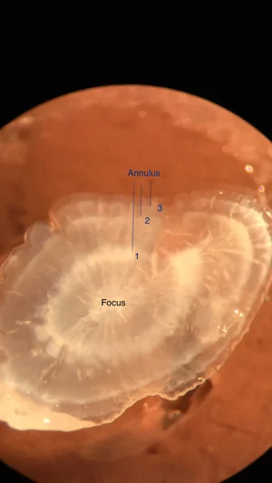

# Assignment: Age-Length Keys & Von Bertalanffy Growth (10 pts)

You will submit your completed Quarto file with all code and answers to Canvas.

## Background

When fisheries biologists sample a fish population, they can easily measure the **length** of every fish they catch. However, determining the **age** of a fish (by reading otoliths, scales, or other hard structures) is time-consuming and expensive. Because of this, biologists typically age only a *subsample* of the fish they catch.

So how do we figure out the age composition of the *entire* catch? We use an **Age-Length Key (ALK)**!

An ALK uses the aged subsample to estimate the probability that a fish of a given length belongs to a certain age class. We then apply those probabilities to the unaged fish to assign ages to the full sample.

{width="400"}

Today we will:

1.  Load a real dataset with age and length data
2.  Build an Age-Length Key
3.  Visualize the ALK with a **bubble plot** and an **area plot**
4.  Fit a **Von Bertalanffy growth curve** to the age-length data.

## Part 1: Setting Up

We will use the `FSA` and `FSAdata` packages. If you have not installed them yet, **run this in the console (NOT in the Quarto file)**:

```{r eval=FALSE}
install.packages("FSA")
install.packages("FSAdata")
install.packages("ggplot2")
install.packages("dplyr")
```

::: callout-warning
## Do not install the packages un your Quarto file

Packages have to be installed once per computer.

Do not install these packages in your Quarto file.
:::

Now, load the packages in your Quarto file:

```{r}
library(FSA)
library(FSAdata)
library(ggplot2)
library(dplyr)
```

## Part 2: Loading the Data

We will use the `CreekChub` dataset from the `FSAdata` package. This package comes with a lot of real world datasets, which is super useful!

Creek Chubs (*Semotilus atromaculatus*) are small freshwater fish found throughout eastern North America.

```{r}
data(CreekChub)
```

Let's look at the data:

```{r}
head(CreekChub)
```

::: callout-important
## Question 1 (1 pt)

What variables are in this dataset? How many fish are in the dataset? (Use `nrow()` to find out)
:::

## Part 3: Simulating a Field Scenario

In real life, we would measure the length of ALL fish but only age a smaller subsample. Let's simulate that.

We already know how many fish we have.

Now, let's create **length categories** (also called length bins). This groups fish into intervals. We will use 10-mm length bins:

```{r}
CreekChub$LenCat <- lencat(CreekChub$len, w = 10)
```

Let's look at what happened:

```{r}
head(CreekChub)
```

Notice a new column `LenCat` was added. Each fish is now assigned to a length bin.

Now, let's simulate our field scenario. We will randomly sample some fish to "age" (our aged subsample), and the rest will be "unaged":

```{r}
set.seed(452) # So everyone gets the same result

# Randomly select ~40% of fish to be "aged"
n <- nrow(CreekChub)
aged_indices <- sample(1:n, size = round(0.45 * n))

# Create aged and unaged datasets
aged <- CreekChub[aged_indices, ]
unaged <- CreekChub[-aged_indices, ]
```

::: callout-important
## Question 2 (1 pt)

How many fish are in the aged subsample? How many are in the unaged group? Why did we use `set.seed()`?
:::

## Part 4: Building the Age-Length Key

Now, let's build the Age-Length Key from our aged subsample. The ALK tells us: *for a fish in a given length category, what is the probability it belongs to each age class?*

```{r}
raw <- xtabs(~ LenCat + age, data = aged)
raw
```

This gives us the **raw counts** - how many aged fish in each length bin belong to each age. Now let's convert those to **proportions** (probabilities):

```{r}
alk <- prop.table(raw, margin = 1)
round(alk, 2)
```

The `margin = 1` means we calculate proportions across each row (each length category). Each row should sum to 1.

::: callout-important
## Question 3 (1 pt)

Look at the ALK table. Pick three length category and describe what the proportions tell you. For example: "A fish in the \_\_\_ mm length category has a \_\_\_% chance of being age \_\_\_ and a \_\_\_% chance of being age \_\_\_."
:::

## Part 5: Bubble Plot

A **bubble plot** is a great way to visualize an ALK. The size of each bubble represents the proportion of fish at that age within each length category.

```{r}
# Convert ALK to a data frame for plotting
alk_df <- as.data.frame(alk)
colnames(alk_df) <- c("LenCat", "Age", "Proportion")
alk_df$LenCat <- as.numeric(as.character(alk_df$LenCat))
alk_df$Age <- as.numeric(as.character(alk_df$Age))

# Remove zero proportions for cleaner plotting
alk_df <- alk_df[alk_df$Proportion > 0, ]

ggplot(alk_df, aes(x = Age, y = LenCat, size = Proportion)) +
  geom_point(alpha = 0.6, color = "steelblue") +
  scale_size_continuous(range = c(1, 12)) +
  labs(x = "Age (years)", y = "Length Category (mm)",
       title = "Age-Length Key: Bubble Plot") +
  theme_classic()
```

::: callout-important
## Question 4 (1 pt)

Describe the pattern you see in the bubble plot. Is there a general trend between age and length? Are there any length categories where fish could be multiple ages?
:::

## Part 6: Area Plot

An **area plot** (also called a stacked area chart) shows the same information differently. It displays how the age composition changes across length categories.

```{r}
alk_df2 <- as.data.frame(alk)
colnames(alk_df2) <- c("LenCat", "Age", "Proportion")
alk_df2$LenCat <- as.numeric(as.character(alk_df2$LenCat))
alk_df2$Age <- factor(alk_df2$Age)

ggplot(alk_df2, aes(x = LenCat, y = Proportion, fill = Age)) +
  geom_area(position = "stack", alpha = 0.8) +
  labs(x = "Length Category (mm)", y = "Proportion",
       title = "Age-Length Key: Area Plot",
       fill = "Age") +
  scale_fill_brewer(palette = "Set3") +
  theme_classic()
```

::: callout-important
## Question 5 (1 pt)

Compare the bubble plot and the area plot. Which one do you think is more useful for understanding the age-length relationship? Explain why.
:::

## Part 7: Applying the ALK to Unaged Fish

Now, let's use the ALK to assign ages to the fish we didn't age. The `alkIndivAge()` function from the `FSA` package does this for us:

```{r}
# Apply the ALK to assign ages to the unaged fish
unaged_with_ages <- alkIndivAge(alk, age ~ len, data = unaged)
```

Now let's combine the aged fish with the newly-assigned unaged fish to get the full dataset:

```{r}
full_data <- rbind(aged, unaged_with_ages)
```

Let's see how many fish we have at each age now:

```{r}
table(full_data$age)
```

::: callout-important
## Question 6 (1 pt)

How does this compare to the original age distribution? Run `table(CreekChub$age)` to see the original. Are they similar? Why might there be small differences?
:::

## Part 8: Von Bertalanffy Growth Curve

Now that we have age-length data for the full sample, let's fit a Von Bertalanffy growth curve.

Remember the equation:

$$
L_t = L_\infty (1-e^{-K(t-t_0)})
$$

Where:

-   $L_t$ = expected length at age $t$
-   $L_\infty$ = asymptotic maximum length
-   $K$ = Brody growth coefficient (how fast fish approach $L_\infty$)
-   $t_0$ = theoretical age at length zero

First, let's plot the raw age-length data:

```{r}
plot(len ~ age, data = full_data,
     xlab = "Age (years)", ylab = "Total Length (mm)",
     main = "Creek Chub: Age vs Length",
     pch = 16, col = rgb(0, 0, 0, 0.3))
```

Now, let's fit the Von Bertalanffy model. We need starting values for the parameters. These are some good starting values based on published data.

```{r}
sv_manual <- list(Linf = 200, K = 0.3, t0 = -1)
```

Now we define the Von Bertalanffy function and fit the model using `nls()` (nonlinear least squares):

```{r}
library(minpack.lm)

vb <- vbFuns("Typical")
sv <- vbStarts(len ~ age, data = full_data)

fit <- nlsLM(len ~ vb(age, Linf, K, t0),
             data = full_data,
             start = sv)

summary(fit)

summary(fit)
```

Let's extract the parameter estimates:

```{r}
coef(fit)
```

::: callout-important
## Question 7 (2 pts)

Report the estimated values of $L_\infty$, $K$, and $t_0$.

Interpret each one in the context of Creek Chub biology:

-   What does $L_\infty$ tell you about the maximum size?
-   Is $K$ relatively high or low? What does that mean for how fast they grow? –\> You can Google this
-   What does $t_0$ represent? Is a negative value expected? –\> You can Google this
:::

## Part 9: Plotting the Von Bertalanffy Curve

Now let's overlay the fitted curve on our data:

```{r}
# Create a sequence of ages for the curve
age_seq <- seq(min(full_data$age,na.rm = TRUE), max(full_data$age, na.rm = TRUE), length.out = 100)

# Predict lengths
pred_len <- predict(fit, newdata = data.frame(age = age_seq))

# Plot
plot(len ~ age, data = full_data,
     xlab = "Age (years)", ylab = "Total Length (mm)",
     main = "Von Bertalanffy Growth Curve - Creek Chub",
     pch = 16, col = rgb(0, 0, 0, 0.3))
lines(age_seq, pred_len, col = "red", lwd = 3)

# Add Linf line
abline(h = coef(fit)["Linf"], col = "blue", lty = 2, lwd = 2)
legend("bottomright",
       legend = c("Observed", "VB Curve", expression(L[infinity])),
       pch = c(16, NA, NA),
       lty = c(NA, 1, 2),
       col = c("black", "red", "blue"),
       lwd = c(NA, 3, 2))
```

::: callout-important
## Question 8 (1 pt)

Look at the plot. Does the Von Bertalanffy curve seem to fit the data well? Are there any ages where the fit seems better or worse? What does the dashed blue line represent?
:::

## Part 10: Thinking Question

::: callout-important
## Question 9 (1 pt)

Imagine you are a fisheries biologist managing a Creek Chub population. You have a limited budget and can only age 50 fish out of 500 that you caught. Based on what you learned today:

1.  How would you select which fish to age? Would you age them randomly, or would you try to age fish from specific length bins?
2.  Why is the Age-Length Key approach useful in fisheries management?
:::

Upload your completed Quarto file to Canvas.
