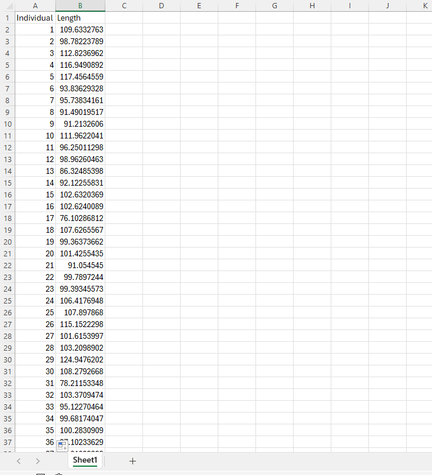
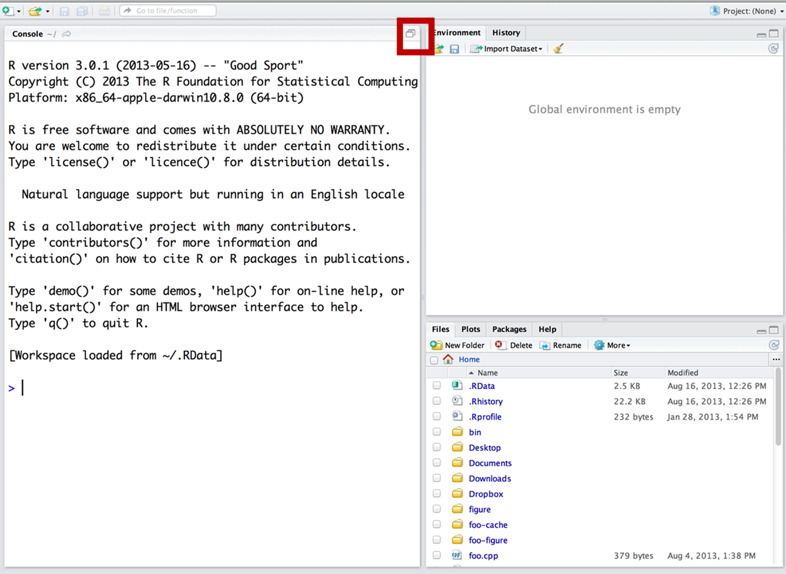

# Assignment 2 (10 pts)

You will submit:

1\) Your excel file with all formulas

2\) A Quarto file with your R code

Raise your hand if you have any questions.

## Random sampling

You are working in a small pond in New England. This pond has exactly 100 American eels (*Anguila rostrata)*. The mean total length of this population is 100-cm. Similar to the example we did in class, we will be randomly sampling a small number (n=12) and estimating the mean of the population. We will also be estimating the standard error. In this case, we know the real population mean (100-cm) and thus, we can tell whether our mean estimate was close or not to the real population mean!

{width="428"}

We will be doing this pretty straightforward exercise in both Excel and program R.

On Canvas there should be 2 files. Download both of them. Use `eel.xlsx` for excel, and `eel.csv` for program R.

### Excel

When you download and open the file you should see the following:



This file contains the size of EVERY SINGLE INDIVIDUAL in the population (100 eels). We will be sampling 15 individuals at random.

Before we do that, you should make sure I am not lying to you and check whether the mean length is actually 100.

In cell B102 you can estimate the mean **population** length by typing:

```{}
=AVERAGE(B2:B101)
```

If you get 100, you can continue, if you don't, figure out what's going on before continuing.

#### Let's sample!

Let's now assume we are out fishing and you catch 12 individuals (random sampling). Selecting a random sample in excel is annoying, but we will do it once. Moving forward, we will be using R.

In order to create a random sample, name column C "sample Length" and then we can sample our 12 individuals. Unfortunately, Excel does not have a great function for sampling without replacement... so, we need to add the **Data analysis add-in:**

In order to add data analysis go to File \> Options \> Add-Ins, then in the "Manage" dropdown, select "Excel Add-ins" and click "Go". In the available add-ins list, check the box next to "Data Analysis Add-in" and click "OK".

Now, with this data analysis add-in we can sample. Go to "Data", and on the Analyze section you should be able to see the Analysis Add-in. Click it and select "sampling".

For input range select ALL the lengths from the individuals (all 100). For number of samples select 12, and select C2:C13 as the output range.

#### Estimates

Next, estimate the mean of your sample using the `AVERAGE` function. Estimate the Standard Deviation using `STDEV.S` and a confidence interval using `CONFIDENCE.T` with an alpha of 0.05. If you don't know how to do it check this 🔗 [website](https://www.datacamp.com/tutorial/how-to-calculate-confidence-intervals-in-excel) 🔗.

You can also raise your hand if you're still having issues.

### Program R

#### Reminders for those new to R

**You can skip this section if you feel comfortable with R**

When using RStudio, you should avoid writing code in the "console". Remember this screen?



Open R-Studio and make sure you are on your WFS452 project. Go to file \> new script. If you only see three screens, make sure to press the button in the red square, and then you should look something like this:


Write all your code in the source section. Then you can run each line by pressing the `run` button or by hitting `ctrl` + `enter`.

You can import data of various formats into R; they include data tables in the form of `.dbf`, `.csv`, and `.xlsx` files or even spatial data such as vectors `.shp` or rasters `.nc`.

But the most common type of data files imported into R are probably`.csv` files.

You can import the dataset using the function `read.csv()`

```{r eval=FALSE}
eel<-read.csv('eel.csv')
```

How do you find the file path?

For mac, open Finder, click to the folder where you saved your data, find your file, right-click (or ctrl-click) it, and then click on GetInfo.

For Windows, you can search documents, or you can look at the latest downloads on your browser.

When we read a datafile, we need to create an "R object". We can do it this way:

$$
\underbrace{eel}_{Object\; name} \; \; \; \underbrace{<-}_{arrow} \; \; \underbrace{read.csv('eel.csv')}_{Data}
$$

### R questions

**If you skipped the previous section, continue here**

If you want to look at the top five rows of your head you can use the following:

```{r}
head(eel)
```

We will do the same exact analysis we did in excel. First, we need to confirm the population mean:

```{r}
mean(eel$Length)
```

And do a histogram of the population using `hist()`. If you need help with a function, you can run `?hist` to open the help file.

::: callout-important
## Question 1

1.  Do the histogram using hist(), and describe what it does
:::

Then, let's sample 12 individuals using:

```{r}
sampled.eels<-sample(eel$Length,12)
```

And now estimate the mean using `mean()`. Call this object mean.eels, then print it by using `mean.eels`. You should do all this in the same chunk (sample, mean, and print).

Be aware than your sample will be different than your excel sample.

::: callout-important
## Question 2

2.1 In Quarto, **as text, not in a chunk,** write down the estimated mean from the previous code.

2.2 Run that same line again (sample, mean and print). You can do this by pressing the green play button that is on the chunk. Write the new mean in your quarto file, again as text, not in a chunk.

2.3 Do 1.2 10 times. Write all the means. Describe how close or far they are
:::

For your last value, estimate the mean, the standard deviation using `sd`, and the confidence interval using the following equation:

$$
CI = mean \pm CritValue*std.err
$$

To obtain the critical value, you use:

```{r}
crit<-qt(0.975,df=12-1) #trust me on this for now
```

And to estimate the standard error you use:

$$
std.err = st.dev \div  \sqrt{n}
$$

And remember that n is 12.

Now, lets do a fun simulation.

First off, let's install a package.

**YOU ONLY NEED TO INSTALL A PACKAGE ONCE, AND YOU SHOULD NOT DO IN A QUARTO FILE. COPY THIS AND RUN IT IN THE CONSOLE:**

```{r eval=FALSE}
install.packages("ggplot2")
```

That is a package that will help us make some nice plots. ow that you installed itm you do not have to install it ever again in your computer.

On you Quarto file, copy and run the following code, it may seem complex, it is OK if you do not fully understand it.

```{r}
set.seed(123)
mu=mean(eel$Length)
experiment<-1:100
n<-12
means<-rep(NA,100) #For the means
s<-rep(NA,100) #sd
SE<-rep(NA,100) #SE
LCI<-rep(NA,100) # Lower CI
UCI<-rep(NA,100) # Upper CI
inclusive<-rep(NA,100) #is the real parameter included?
alpha<-0.05 #our alpha
lower<-qnorm(alpha/2) #lower critical value
upper<-qnorm(1-alpha/2) #upper critical value
for(i in 1:100){
sample<-sample(eel$Length,n)
means[i]<-mean(sample)
s[i]<-sd(sample)
SE[i]<-s[i]/sqrt(n)
LCI[i]<-means[i]+SE[i]*lower
UCI[i]<-means[i]+SE[i]*upper
if(mu<UCI[i] & mu> LCI[i]){
  inclusive[i]<-T} else{
    inclusive[i]<-F
  }
}

df<-data.frame(experiment,means,s,SE,LCI,UCI,inclusive)


library(ggplot2)


ggplot(df, aes(x = experiment, y = means,colour=inclusive,ymin = LCI, ymax=UCI)) +
   geom_point() +
   geom_hline(yintercept = mu, color = "black", linetype = "longdash") +
   scale_y_continuous(name = "", limits = c(min(df$LCI) - min(df$LCI)/10 , max(df$UCI + max(df$UCI)/10))) +
   scale_x_continuous(limits = c(0, 100)) +
   theme_classic()+
  scale_color_manual(values=c("#ec280e", "#06b512"))+
  labs(x= "sampling event", y="estimate")+
  geom_errorbar(width = 0)
```

::: callout-important
## Question 3

This simulation sampled the population 100 times. Each time, it estimated a mean, and a confidence interval. It chose a color based on whether the real parameter was included or not.

Answer: \
3.1 do these results make sense? Why or why not?

3.2 What would happen if the sampling was not random?
:::

Upload the excel file (5 pts) and the Quarto file (5 pts).
