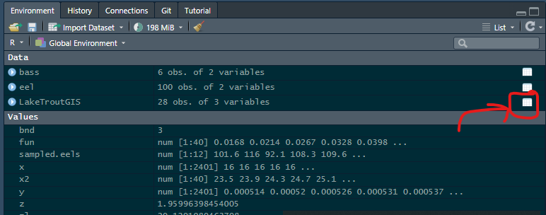

## Recruitment

20 pts.

We will work on modeling Spawner-Recruit data using a Beverton-Holt model and a Ricker stock-recruit model.

Download the Lake Trout Data and look at it. It has three columns:

1.  year- year in which data was collected
2.  stock- the mean catch-per-unit-effort of adult female Lake Trout per 1000 m of gillnet from fall spawning surveys
3.  recruits- density of age-0 fish per ha captured the following fall in bottom trawls

Data was recorded from an area near Gull Island Shoal in the Apostle Islands region of Lake Superior (Schram et al. 1995)

Remember to load the data using:

```{r eval=F}

LakeTroutGIS<-read.csv("laketroutdata.csv")
```

#### Explore the data

You can explore the data using any of the following commands:

```{r eval=FALSE}
head(LakeTroutGIS)
str(LakeTroutGIS)
summary(LakeTroutGIS)
```

You can also use the RStudio tool to explore the data by pressing the table on the environment tab:

{width="645"}

::: {.callout-note appearance="minimal"}
## Q1

After exploring the data, describe, how many observations, and which variables are in this dataset.
:::

The first step when analyzing stock-recruitment data is to plot your data. The easiest way to plot the data is doing a scatterplot using the following:

```{r eval = F}
plot(recruits~stock,data=LakeTroutGIS)
```

::: {.callout-note appearance="minimal"}
## Q2

After plotting the data, change the shape and color of the plotted points. Here is a good guide on how to do it:\
<https://www.sthda.com/english/wiki/r-plot-pch-symbols-the-different-point-shapes-available-in-r>
:::

### Fitting the Beverton Holt Model

We will now fit the Beverton-Hort model:

$$R=\frac{\alpha S}{(1+ \beta S)}$$ This model assumes that recruitment is an asymptotic function of spawner abundance.

::: {.callout-note appearance="minimal"}
## Q3

Describe each component of the Beverton-Holt equation, and try to describe what an asymptotic function of spawner abundance means.

You may use any source to look at a definition of an asymptotic function (ChatGPT, Google, etc). But **USE YOUR OWN WORDS TO DESCRIBE IT.**
:::

We will use package `FSA` (Fisheries Stock Assessments package). This is the best package in R to run fisheries management analyses. It is the same package you used for assignment#2. Load the package.

#### How to fit a Beverton-Holt model?

In order to fit a Beverton-Holt model: $R=\frac{\alpha S}{(1+ \beta S)}$ we need to find a good value for $\alpha$ and a good value for $\beta$. This is **REALLY HARD.** Essentially, you come up with a value for $\alpha$ and a value for $\beta$ run the model, and see how far the points are from the predicted points (points predicted by the model). Then, we give $\alpha$ and $\beta$ some different values and see if this model fits better. We do this until we find the best solution. This is extremely time consuming, and you would spend **months** trying to find te combination of $\alpha$ and $\beta$ that works best. Luckily, there is a great solution for this.

The first step, is finding a good first guess of alpha and beta. This will help us save time and find a good solution in the end. Finding good values is very hard. But there is some good R code that can help us with this!

Use this code but replace both y and x. We have three variables: year, stock, and recruits. Think which one of them is the response variable (y) and which one is the explanatory variable (x). Once you figure this out you can replca both y and x. Do not continue until you have confirmation this is correct!

```{r eval = F, echo=FALSE}
bh1s <- srStarts(recruits~stock,data=LakeTroutGIS,type="BevertonHolt",param=1)
unlist(bh1s) 
```

```{r eval = F}
bh1s <- srStarts(y~x,data=LakeTroutGIS,type="BevertonHolt",param=1)
unlist(bh1s) 
```

This code finds good starting values. But this are still not the best values for $\alpha$ and $\beta$.

::: {.callout-note appearance="minimal"}
## Q4

What are your starting alpha and beta values?
:::

### Finding the best values

The first step to find the best values is to transform the data. This is because this relationship:


is not linear. We need to slightly transform the equation, in order to more easily compare the predicted vs. the observed. We will change the values to:

$$logR = log (\frac{\alpha S}{1+\beta S})$$

Trust me on the need to do this. As you move forward in your career, you will find that a lot of data needs to be log-transformed (in this case log is the natural logarithm!)

Let's obtain the natural log of the recruits (logR)

```{r eval=F}
LakeTroutGIS$logR<-log(LakeTroutGIS$recruits)
```

Excel has a great tool to find the best values (we will use this tool pretty often in this course!)

Save this csv with:

```{r eval=F}
write.csv(LakeTroutGIS,file="labfile1.csv",row.names=F)
```

and open this file in Excel (DO NOT CLOSE R).

In Excel, next to logR create a new column called predicted logR, and estimate it using your starting $\alpha$ and $\beta$ values. Remember we are using the natural log. Use ln(), Also, do not write the numbers in the formula, rather, write them in a cell, and refer to that cell later on. Name your alpha: "alpha B-H", and your beta "beta-BH". Use the following formula:

$$logR = log (\frac{\alpha S}{1+\beta S})$$ Now, in a new column (sqdiff) estimate the squared difference of observed logR and predicted logR, and estimate the sum of this column.

We will use a new add-in called solver. Add this add-in to your excel (you did this for assignment 1, with the data analysis add-in)

Use solver, and obtain the best alpha and beta values, for the B-H model. After doing this, transform the predicted logR into predicted Recruits (EXP(predicted logR)). We want the predicted recruits instead of the predicted logRecruits. **Don't know how or why to use solver?** **Raise your hand!**

::: {.callout-note appearance="minimal"}
## Q5

a\) Report your alpha and beta.

b\) In Excel plot the relation between Stock and recruits with points, and the predicted recruits with a line. IS this a good model?
:::

Now, let's do the same thing, but with the density independent model.

For this model, we will use: $$logR = log (\alpha S)$$

Remember log is natural log (LN in excel).

In a new cell in excel, write the original alpha value, and name it alphalinear.

Now: 1) Create a new column called logRlinearmodel. 2) In this column, estimate the predicted values using the equation. 3) Use solver to find the best solution. 4) Compare the sum of the squared differences.

::: {.callout-note appearance="minimal"}
## Q6

a\) Report your alpha and beta. b) Plot the relation between Stock and recruits with points, and the predicted recruits with a line. IS this a good model?
:::

Now, finally, backtransform you logRlinearmodel (use EXP). In your previous plot, add a line with the values for the linear model. In this plot, now you should have: points for the observed data, and lines for both models.

::: {.callout-note appearance="minimal"}
## Q7

Explain the differences between both models. Which do you think is better?
:::

Now we are going to do everything in R. We will run both models, and compare them using an ANOVA. Because things are faster in R, we will also run the Ricker model.

I will provide you with all the code. For each line that I provide, try to comment what you think that line of code does. You can add comments using `#` after the code

```{r eval=F}
bh1 <- logR~log((a*stock)/(1+b*stock))
bh1nls <- nls(bh1,data=LakeTroutGIS,start=bh1s)
bh0 <- logR~log(a*stock) 
bh0s <- bh1s[1] 
bh0nls <- nls(bh0,data=LakeTroutGIS,start=bh0s)
bh2 <- logR~log(a*stock*exp(-b*stock))
bh2nls <- nls(bh2,data=LakeTroutGIS,start=bh1s)
anova(bh0nls,bh1nls,bh2nls)

```

## 

::: {.callout-note appearance="minimal"}
## Q8

a\) To the best of your ability, explain what each line of the last bunch of provided code did.

b\) Based on the Anova, is one model better than the other?
:::

Let's graph the data and the lines:

```{r eval=F}
plot(recruits~stock,data=LakeTroutGIS)
curve((coef(bh1nls)[1]*x)/(1+coef(bh1nls)[2]*x),from=0,to=120,col="red",lwd=2,add=TRUE)
curve(coef(bh0nls)[1]*x,from=0,to=120,col="black",lwd=2,add=TRUE)
curve((coef(bh2nls)[1]*x)/(1+coef(bh2nls)[2]*x),from=0,to=120,col="blue",lwd=2,add=TRUE)
legend("topleft",legend=c("black line","blue line","red line"),
col=c("black","blue","red"),lwd=2,cex=0.6)
```

Modify the "legend" section so that rather than blue line and red line, they say the model they are representing. You can also make it prettier.

::: {.callout-note appearance="minimal"}
## Q9

Upload your R plot to Canvas
:::

::: {.callout-note appearance="minimal"}
## Q10

Answer, do you think recruitment models are generally precise?
:::

Thank you, And I hope you are able to use these tools in the future!

Each question is worth 2 pts.

## Biblography

Schram, S. T., J. H. Selgeby, C. R. Bronte, and B. L. Swanson. 1995. Population Recovery and Natural Recruitment of Lake Trout at Gull Island Shoal, Lake Superior, 1964–1992. Journal of Great Lakes Research 21:225–232.
