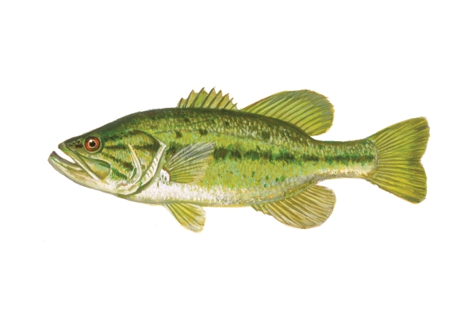

## Estimating abundance from Mark-Recapture Data

This is similar tothe exercise we did in class on Tuesday. You will be tasked with estimating abundance using data from a Mark-Recapture study. You will be doing it all in R and you are expected to upload your R script.

We will be using a slightly modified formula than the one from Tuesday. **If I ask for a Mark-Recapture abundance estimate during the exam, this is the equation you should use.** This equation has been proven to better at estimating fish abundance, it is a modification of the traditional Lincoln-Peterson estimator and it uses the following formula:

$$
\hat{N} = \frac{(M+1)(C+1)}{R+1}-1
$$

where $\hat{N}$ is the estimated population abundance, M is the number of marked individuals in the population (usually number of individuals caught during the first sampling event), C is the number of individuals captured during the second attempt and R is the number of recaptures (number of marked individuals captured during the second attempt.

Seber in 1982 also figured out how to estimate the variance of $\hat{N}$. And it is using this equation:

$$
V(\hat{N}) = \frac{(M+1)(C+1)(M-R)(C-R)}{(R+1)^2 (R+2)}-1
$$

```{r}
m<-49
c<-143
r<-23

N<-(((m+1)*(c+1))/(r+1))-1

v<-(((m+1)*(c+1)*(m-r)*(c-r))/ (((r+1)^2)*(r+2))         )-1


```

The math behind this specific variance is pretty complicated, but what you need to know is: "it helps us estimate the Confidence Intervals!". After we estimate the variance, we can estimate the confidence interval using:

$$
\hat{N} \pm 1.96(\sqrt{V(\hat{N})} \ )
$$

This example was developed by Dr. Ogle and modified by me:

Young and Hayes ([2001](https://fishr-core-team.github.io/fishR/teaching/posts/2019-3-8_MR_URBrownTrout/#ref-younghayes_2001)) described a study where [Brown Trout](https://en.wikipedia.org/wiki/Brown_trout) (*Salmo trutta*) in several rivers were captured by experienced fly fishers, tagged at the base of the dorsal fin with a colored dart tag, and then observed by divers drifting through the sample area two days later. In the [Ugly River](https://nzfishing.com/west-coast/where-to-fish/ugly-river/), 49 trout were marked, 143 fish were observed by the divers, and 23 fish observed by the divers were tagged.


Using R construct a population estimate, with 95% confidence interval, for the Brown Trout in this section of the Ugly River. be carefult writing your code as you will be turning in your R file.

Also within your R script, carefully interpret your results. In R, you can use the \# symbol to write comments. For example:

```{r}
# this code won't run because we are using #
#I can write stuff in R
# using this
```

Use the `#` symbol to write comments or answer questions.

## Estimating abundance from depletion methods

In this example, we are working with data from Maceina et al.

Managers and researchers examined the population of harvestable Largemouth Bass (*Micropterus salmoides*) in Conner Cove of Lake Guntersville, Alabama (a 28,000 ha impoundment of the Tennessee River) in March, 1992.



They did a depletion study in order to estimate abundance and catchability. Their recorded catch and effort was the following:

```{r}
bass <- data.frame(catch=c(7,7,4,1,2,1),effort=c(10,10,10,10,6,10))
head(bass)
```

Follow all the steps to estimate catchability and abundance from the depletion method.

First step:

Add one column to the database and estimate catch per unit effort. To add a column, you can use the dollar sign (\$). Here, you only need to write the equation for CPUE on the right side of the "\<-"

```{r eval=FALSE}
bass$CPUE <- bass$catch/bass$effort
```

We need a new column with the cumulative catch (K), see powerpoint.We can add this using the following function:`cumsum(bass$catch) - bass$catch)`. Try to add it.

Now, you can run a linear model using lm. Remember, the explanatory variable is K, and CPUE is the response variable. To run it, the code should look something like this:

```{r eval=FALSE}
lm1<-lm(CPUE ~ K, data=bass)

```

Your code might need to look different depending on the name you gave your variables.

You can look at the slope and intercept of your data using:

```{r eval=FALSE}
coef(lm1)
```

Based on the results from the linear model, calculate and report both effort and abundance.

### An easier way to do it

Now that you estimated it, I will show you an easier way to do it. In R, we can download and use packages that help us with our analyses. In this class we will use a package called: `FSA: Simple Fisheries Stock Assessment Methods`

To download it (you only have to do this once per laptop, once a package is download it is good to be used):

```{r eval=FALSE}
install.packages("FSA")
```

And to use it during your session, you need to "load it". You do that with:

```{r}
library(FSA)
```

This package has a function that estimates abundance and catchability. All we have to give the package is the catch, and the effort (if the effort is constant, we don't have to do this). Essentially, you could have skipped EVERYTHING you did, and just run this:

```{r eval=FALSE}
depletion(bass$catch, bass$effort)

```

You can also run the following line to plot the cumulative catch-cpue relation:

```{r eval=FALSE}
plot(depletion(bass$catch, bass$effort))
```

Once you run these two lines of code, the lab is complete. Upload all of your code and answers in a single R file to CANVAS.