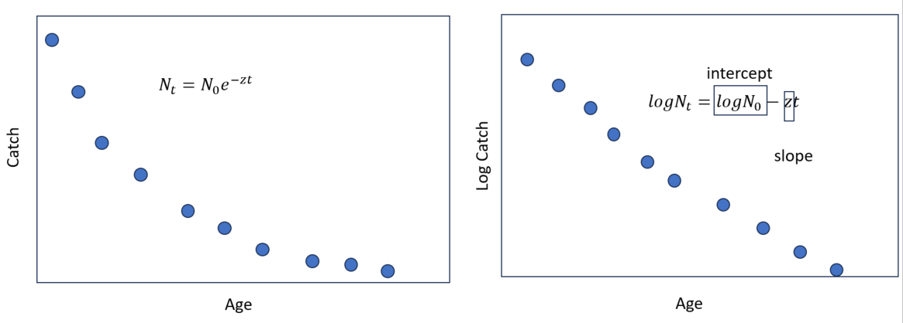

## Mortality Lab

25 pts total.

Upload a rendered quarto file. The rendered file should contain ALL OF THE CODE and all outputs. If that is not present you won't get full credit.

------------------------------------------------------------------------

### Packages

The following packages are required to complete all of the examples: `FSA` and `ggplot2`.

We have used `FSA` extensively, it's the one Fisheries package that has pretty much all of the necessary analyses. The package `ggplot2` is great for plotting in R, we have been using it as well.

```{r warning=FALSE, message=FALSE}

library(FSA)     

library(ggplot2)      
```

## Basic Mortality Computations

There are three main ways we can estimate mortality: absolute interval, interval mortality rate, and instantaneous mortality rate.

The equation for the absolute mortality rate is:

$$
\frac{N_t - N_{t+1}}{\hat{I_t}}
$$

Where $N_t$ is individuals at time t, $N_{t+1}$ is individuals at time t+1. And $\hat{I_t}$ is the interval length. However, we usually estimate rates. We can estimate the morality rate using the following:

$$
A=\frac{N_t - N_{t+1}}{N_t}
$$

And $S$ (survival being): $S=1-A$

Because of the "non-linear", exponential nature of fish mortality, we tend to use the instantaneous mortality rate. These table shows how to estimate the rates and transform interval to instantaneous rates:

| Mortality rates | Total | Fishing | Natural |
|------------------|------------------|------------------|------------------|
| Interval | $$
A = 1-e^{-z} = \mu + \upsilon
$$ | $$
\mu=\frac{FA}{Z} = \frac{\upsilon F}M
$$ | $$
\upsilon=\frac{MA}{Z} = \frac{\mu M}F
$$ |
| Instantaneous | $$
Z=-log(1-A) = F +M
$$ | $$
F=\frac{\mu Z}{A} = \frac{\mu M}\upsilon
$$ | $$
M=\frac{\upsilon Z}{A} = \frac{\upsilon F}\mu
$$ |

: Mortality rates. Symbols are as follows: (A) is interval mortality rate; (Z) is instantaneous mortality rate; ($\mu$) is interval fishing mortality; ($\upsilon$) is interval natural mortality, (F) is instantaneous fishing mortality rate; and (M) is natural instantaneous mortality rate.

::: callout-important
## Remember! 🧠

We use the natural log! every equation with log in here is the natural log!
:::

A cool thing about Z is we can easily estimate the mortality rate for shorter intervals. Imagine $Z_{year}$ is 0.8, then $Z_{month}$ is 0.8/12. Supper handy!

Take, for example, a hypothetical fish population consisting of a single age-group. At the start of a 12-month interval, the age-group consists of 1000 individuals, and at the end it has been reduced by mortality to 700. For this example,

```{r}
N0 <- 1000                       # Initial population
N12 <- 700                       # Final population

```

::: callout-warning
## Question 1 ✏️ 3 points

Estimate using R, with basic functions (use the equations I showed earlier!):

1.  the interval absolute mortality (number of deaths)
2.  The interval (12 month) mortality rate
3.  The instantaneous mortality rate
:::

This shows the results you should get:

```{r echo=FALSE}
d <- N0-N12              # Interval absolute mortality (i.e., number of deaths)
A12 <- d/N0                      # Interval (12 month) mortality rate

Z12 <- -log(1-A12)            # Instantaneous mortality rate

d
A12
Z12
```

But make sure you have the code as well!

\
Now, suppose we wish to know the fraction of the population remaining, the number of individuals, and the number of deaths at the end of 4 and 8 months intervals. For this, $Z_{12month}$ must be partitioned into 4-month ($Z_{4}$) and 8-month ($Z_{8}$) estimates. This also allows us to estimate the interval mortality rate during 4 months and 8 months.

::: callout-warning
## Question 2 ✏️ 5 pts

Estimate

1.  Monthly instantaneous mortality rate
2.  Four-month Z estimate
3.  Eight-month Z estimate
4.  Interval (4-month) mortality rate
5.  Interval (8-month) mortality rate
6.  Number of deaths and survivors after the first 4 months
7.  Number of deaths and survivors after the first 8 months
8.  Number of deaths during the second 4 months (month 4-8)
:::

Remember that we can estimate number of dead intervals in an interval using: $N_0 A_{interval}$

::: callout-note
## Help!

This will help you with the next question.

Note, you should use `round()` to round the results to a specified number of decimal places. This function requires two arguments -- the value(s) to be rounded as the first argument and the number of decimal places as the second argument. We cannot have partial dead fish (we only have integers) so when estimating the number of live fish, we use 0 decimal places.
:::

```{r echo=FALSE, results='hide'}
 Z1 <- Z12/12                     # Monthly instantaneous mortality rate
 Z4 <- 4*Z1                    # Four-month Z estimate
  Z8 <- 8*Z1                    # Eight-month Z estimate
A4 <- 1-exp(-Z4)               # Interval (4-month) mortality rate
A8 <- 1-exp(-Z8)              # Interval (8-month) mortality rate
d4 <- N0*A4                      # Deaths in first four-months
round(d4,0)
N4 <- N0-d4                      # Estimated survivors after 4-months
round(N4,0)
d8 <- N0*A8                      # Deaths in first eight-months
round(d8,0)
N8 <- N0-d8                      # Estimated survivors after 8-months
round(N8,0)
d8.4 <- d8-d4                    # Deaths in second four-months
round(d8.4,0)
d12.8 <- d-d8                    # Deaths in third four-months
round(d12.8,0)
```

## Mortality Rates from the Slope of Regression Line {#mortality-rates-from-the-slope-of-regression-line}

The catch-at-age data for one population Walleye (*Sander vitreus*) is in the `catchcurve.csv` file. Read the file into a new object named "cdata".

```{r echo=FALSE}
cdata <- read.csv("catchcurve.csv")
```

Look at the data using:

```{r}
cdata
```

Let's plot and explore the data. We can plot the data using:

```{r}
plot(catch~age,data=cdata,pch=19)
```

::: callout-warning
## Question 3 ✏️ 2 pts

What ages are fully recruited to the gear?
:::

### Preparing Data

Remember that fish have a type 3 survivorship curve. This means their survival is not constant (type 2) and hence, non linear. Therefore, we cannot do a linear regression. However, we can do a log of the linear regression, to "linearize" the data, as per the figure:



We need to log transform the catch data:

```{r}
cdata$logcatch <- log(cdata$catch)
cdata
```

Now, we have a new column, "logcatch".

::: callout-warning
## Question 4 ✏️ 2.5 pts

Plot the data, but use the log of catch as the y axis instead of simply catch
:::

```{r echo=F, eval=F}
plot(logcatch~age,data=cdata,pch=19)
```

### The Catch-Curve Method -- First Principles

Linear regressions in R are performed with `lm()` where the first argument is a formula of the form `y`\~`x` and the second (`data=`) argument is the data frame in which the variables can be found. An optional third (`subset=`) argument can be used to efficiently create a subset of a data frame to be used for that particular linear model. Here we will use the subset function because we need to only analyze individuals that have been recruited to the gear.

Let's run our first catch curve:

```{r results='hide'}
cc1 <- lm(logcatch~age,data=cdata,subset=age>=3)
summary(cc1)
```

::: callout-warning
## Question 5 ✏️ 2 pts.

1.  Look at the summary output and write, what is the value of the instantaneous mortality rate ($Z$)?
2.  Why did we use `subset=age>=3` in the code to run the regression?
:::

The estimate of the instantaneous mortality rate ($Z$) is obtained from the estimated slope.

We can also, plot our linear regression:

```{r}
cdata$W<-predict.lm(cc1,cdata) #used to obtain the regression
ggplot(cdata,aes(x=age,y=logcatch))+
  geom_point()+
  geom_line(aes(y=W))+
  theme_classic()
```

::: callout-warning
## Question 6 ✏️ 1.5 pts

Does the "model" or "regression" seem correct to you?
:::

We can observe the coefficients from the regression using:

```{r eval=FALSE}
coef(cc1)
```

And we can use that to extract $Z$. We can also extract the confidence intervals using the `confint()` function. Let's

```{r}
Z <- -coef(cc1)[2]        # 2nd coefficient of model results
ZCI <- -confint(cc1)[2,]  # 2nd row of confint results

```

::: callout-warning
## Question 7 ✏️ 3 pts

1.  Estimate the annual mortality rate
2.  Estimate the confidence intervals for the annual mortality rate
3.  Interpret the annual mortality rate and confidence intervals. Do you think this is a healthy population?
:::

### The Catch-Curve Method -- Simpler Function

We can use the `catchCurve()` function from the `FSA` package. Note that the original, not logged, catches are given in this function, which means it is way faster!

```{r}
cc3 <- catchCurve(catch~age,cdata,3:10)                    # unweighted catch-curve
summary(cc3)
confint(cc3)
plot(cc3)
```

## Comparing Instantaneous Mortality Rates from Catch Curves

Sometimes we wonder whether two different lakes have a difference in survival. Comparing instantaneous mortality rates ($Z$) for two or more populations is equivalent to comparing the slopes of the catch-curve regression lines. In the file are catch-at-age data for two populations that fully recruited to the gear at age-2. The R code to calculate and compare the slopes of the catch-curve regression lines is given below.

Read the data:

```{r}
twolakes<-read.csv("twolakes.csv")
twolakes
```

::: callout-warning
## Question 8 ✏️ 3 pts

Look at the data, what age are the fish fully recruited to the gear? Is it the same for both populations?
:::

We can run the model as we did before, just now, we need to add the effect of lake:

```{r}
lm1 <- lm(logcatch~age*lake,data=twolakes,subset=age>=2)
#anova(lm1)

```

And we can plot the results:

```{r}
twolakes$W<-predict.lm(lm1,twolakes) #used to obtain the regression
ggplot(twolakes,aes(x=age,y=logcatch,col=lake))+
  geom_point()+
  geom_line(aes(y=W))+
  theme_classic()

```

::: callout-warning
## Question 9 ✏️ 2 pts

1.  Look at the plot, do you think there is a difference in survival between the two lakes? There is no right or wrong answer for this question.
2.  What do you think happened to age 6 fish from lake A?
:::

Finally, we can run an ANCOVA:

```{r eval=FALSE}
anova(lm1)
```

Run the ANOVA and answer:

::: callout-warning
## Question 10 ✏️ 1 pt

1.  Is $Z$ between the two populations actually different?
2.  Was this different from your answer in question 9? Why do you think that happened?
:::