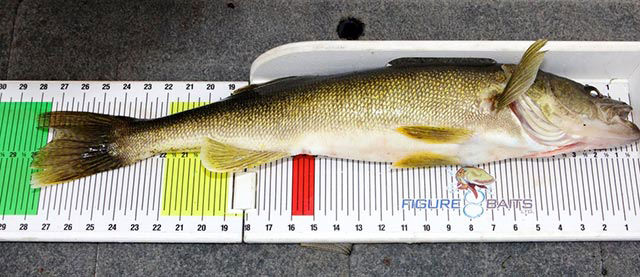

# Information (part 1)

\*\* You will submit a word document and your r code \*\*

This is part 1 of the assignment. We will work on part 2 on Tuesday of next week

------------------------------------------------------------------------

Fish length is likely the information most commonly collected by fisheries biologists and managers. While length is usually not the only information collected by a fisheries biologist, summaries of length information can provide the biologist with a wealth of information on population parameters such as age distributions, growth rates, and mortality rates; the basic biology of the animal; and the effect of management regulations on the fish population. Thus, summarizing length data and then interpreting those summaries is an important task performed by fisheries biologists.



## Section 1

#### **Setting**

Whittlesey Creek is a tributary to Chequamegon Bay of Lake Superior. This stream has been severely degraded by past land use practices including clear-cut logging and channelization to drain wetlands for farming. The “Coaster” Brook Trout (*Salvelinus fontinalis*), a lake-dwelling stream-spawning form of Brook Trout, was largely extirpated from southern Lake Superior and the Whittlesey Creek watershed due to over-fishing and habitat degradation. In 1999, the U.S., Fish and Wildlife Service established the [Whittlesey Creek National Wildlife Refuge](http://www.fws.gov/refuge/whittlesey_creek/) with a primary goal of reestablishing a population of Coaster Brook Trout in Whittlesey Creek. That effort has included experimental introductions of Brook Trout at various life stages and much work to restore habitat.

In July, 2011 a quarter-mile stretch of the lower Whittlesey Creek was modified with the addition of [large woody debris with attached “root balls.”](http://www.fondriest.com/news/natural-stream-restoration-rebuilds-habitats-in-great-lakes-basin.htm) The goal of this project was to alter the morphology of this section of the stream to provide better habitat and water conditions for Brook Trout. In May, 2011 a group of Northland College students conducted two days of sampling with electrofishing gear in order to provide baseline information about the fish populations in this section of the stream. Their sampling yielded eight total Brook Trout but relatively larger numbers of Coho Salmon (*Oncorhynchus kisutch*), Rainbow Trout (*Oncorhynchus mykiss*), and sculpins (primarily Slimy Sculpin (*Cottus cognatus*), but some Mottled Sculpin (*Cottus bairdii*)). Data from the catches of Coho Salmon, Rainbow Trout, and sculpins will be analyzed in this case study.

Data from the sampling collected by the students were stored in `Whittlesey2011.csv`. The variables in this data set are defined as follows,

-   `study`: The name of the study.

-   `netID`: A unique label for each day of sampling.

-   `sDate`: The date of sampling.

-   `run`: A factor indicating if the sample was the `mark`ing or `recap`ture run.

-   `species`: A factor indicating the species captured. Options are `Species1`, `Species2`, or `Species3`. This variable will be discussed in more detail later.

-   `length`: The total length of the sampled fish to the nearest mm.

-   `clipped`: Indicates if the fish was clipped (=1) or not. All fish in the recapture run were not clipped.

-   `recap`: Indicates if the fish was previously clipped (i.e., a “recapture”; =1) or not. All fish in the marking run could not possibly be a recaptured fish.

-   `notes`: Any specific notes about that particular fish.

::: callout-warning
## Question 1. ✏️ 5 pts

Research basic life history characteristics – especially growth (length-at-age), reproduction and spawning characteristics, and obligation of migratory patterns – of Coho Salmon, Rainbow Trout, and Mottled Sculpin

The Fishes of Tennessee is available online via the UTK library, You can review this book.

Briefly describe the life history of these species in a word document.
:::

------------------------------------------------------------------------

Now we will be constructing histograms. We will use ggplot for this. Remember to load the package using library.

Here are some great resources to help you build a histogram: <https://r-graph-gallery.com/histogram.html>

::: callout-warning
## Question 2. ✏️ 5 pts

On three plots, one per species, construct separate length frequency histograms. MAKE SURE THE BINS MAKE SENSE FOR EACH SPECIES.
:::

How to select bins? Check: <https://r-charts.com/distribution/histogram-binwidth-ggplot2/>

::: callout-warning
## Question 3. ✏️ 5 pts

1.  How many **distinct** age-classes do you see for each species? Provide approximate length ranges for each distinct age-class that you observe.
2.  Which species (Coho Salmon, Rainbow Trout, sculpin) corresponds to each of the length frequency histograms that you constructed? Explain your reasoning with specific references to what you know about the life history characteristics of these species.
3.  What ages would you assign to the first two distinct age-classes observed for Coho Salmon and for Rainbow Trout? Explain your reasoning with specific references to what you know about the life history characteristics of these species.
:::

# Section 2

## Proportional size distribution

Gabelhouse (1984) introduced the five-cell length categorization system that defines lengths for so-called stock, quality, preferred, memorable ,and trophy size individuals of a wide variety of species

::: callout-warning
## Question 4. ✏️ 1 pts

Use the function `psdVal` of package `FSA` and find the categorization of lengths of three species. Report the species you used and the values on the `word` document.
:::

After Looking at those three species, look at the categorization length of Bluegills using `psdVal.`

We will use a dataset from package `FSAdata` . Load teh data using:

```{r}
library(FSAdata)
data(InchLake1)
```

Subset the data to only include Bluegill from 2007. You can do so using a similar function to:

```{r eval=FALSE}
bg<-Subset(InchLake1,year==  &  species==)
```

Make sure to fill in the blanks in the code!

::: callout-warning
## Question 5. ✏️ 3 pts

Plot a histogram of the bluegill. Make sure to set the bin widths so that each bin represents one length cateogry (substock, stock, quality, preferred, memorable, and trophy).

Make another histogram ONLY for substock fish.
:::

Length frequency data can be summarized into a few useful statistics called proportional size distribution indices (PSD). A PSD index is defined as the proportion of stock-sized fish that are also greater than some other larger size category. Specifically,

$$
RSD = \frac{\text{Number of fish} \geq \text{specified length}}{\text{N fish} \geq \text{stock length}} \times 100
$$

In particularly, PSD is the most common measure in which we estimate the amount of fish that are of quality size or bigger. We use the following equation to estimate it:

$$
PSD = \frac{\text{Number of fish} \geq \text{quality length}}{\text{N fish} \geq \text{sotcklength}} \times 100
$$

::: callout-warning
## Question 6. ✏️ 3 pts

Estimate the PSD for the bluegill in the population

Estimate RSD-Preferred for the bluegill in this population

Estimate RSD-Memorable for the bluegill in the population
:::

------------------------------------------------------------------------

\*\* End of part 1 \*\*